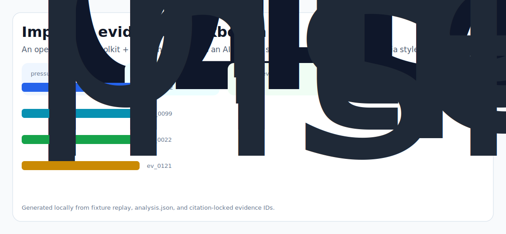
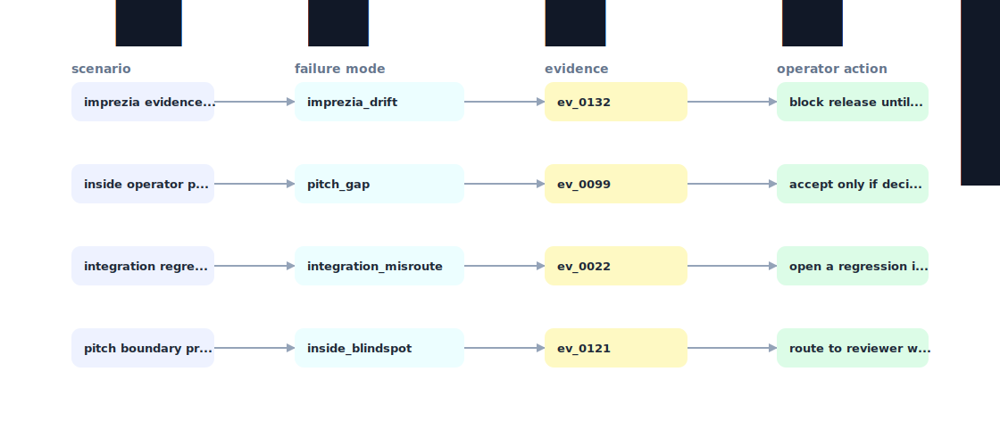

# Intent Lint

An open developer toolkit + benchmark that lets an AI app dev simulate, audit, and gate Imprezia style intent ad insertions before they ship - turning "trust the network" into "trust and verify in CI."



## Why it exists

Imprezia's pitch is "one line integration, ad inside the LLM response, intent matched to advertiser." But every AI app developer who's been at this for 2 weeks knows the real question is: "If I let this network insert brand mentions into my product's voice, how do I prevent (a) hallucinated facts about the brand, (b) tonal mismatch with my product, (c) polic

Most internal demos stop at a pretty chart. This repository is built around the harder part: a repeatable path from fixture, to failure, to evidence, to the operator action a serious team would actually trust.

## What is inside

- A deterministic replay harness tuned around imprezia, pitch, and integration.
- Company-specific strategy code in `src/intent_lint/strategy.py`, not just README-level customization.
- Citation-locked reports where every decision claim has to point back to a generated evidence ID.
- Two visual artifacts generated from the latest run: `outputs/project_working.svg` and `outputs/evidence_map.svg`.
- A portable demo pack with JSON, CSV, Markdown, HTML, SVG, and benchmark artifacts.



## Signals it measures

- `imprezia coverage`
- `pitch risk`
- `integration precision`
- `inside latency`

## Failure modes it plants

- imprezia drift
- pitch gap
- integration misroute
- inside blindspot

## Run it locally

```bash
uv sync
uv run intent-lint all
uv run pytest -q
uv run ruff check .
```

## Outputs worth opening

- `outputs/dashboard.html`
- `outputs/project_working.svg`
- `outputs/evidence_map.svg`
- `outputs/operator_brief.md`
- `outputs/decision_report.md`
- `outputs/strategy_model.json`
- `outputs/demo_pack.zip`

## Sources

- https://www.ycombinator.com/companies/imprezia
- https://www.ycombinator.com/launches/O5Q-imprezia-world-s-first-ai-ad-network
- https://www.ycombinator.com/companies/imprezia/jobs/HDrJSMq-founding-engineer-core-systems
- https://www.ycombinator.com/companies/imprezia/jobs/jjpOc4q-growth-ai-developers
- https://www.linkedin.com/posts/y-combinator_ads-suck-but-only-because-they-interrupt-activity-7356790766544801792-RmCO
- https://www.linkedin.com/in/bisheshkhadka/
- https://x.com/bisheshk
- https://www.linkedin.com/posts/bisheshkhadka_humbled-by-the-response-to-imprezias-launch-activity-7358932922348851201-2fi5
- https://huggingface.co/vectara/hallucination_evaluation_model

## Boundary

Everything runs locally against synthetic fixtures. There are no credentials, no customer records, no outreach files, and no hosted API dependency.
